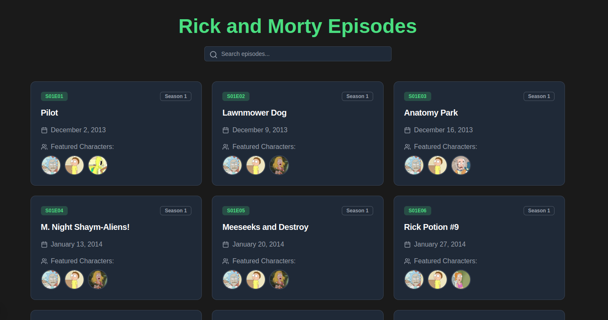
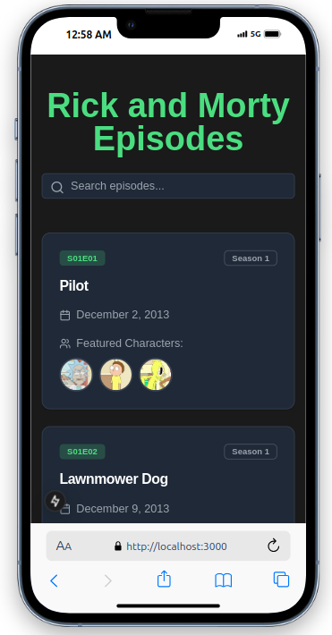

# Rick and Morty Episode Viewer 🛸

A responsive web application built with Next.js that allows users to browse and search episodes from the Rick and Morty TV series. This project was created as part of the NETPIPO Front-End Intern Evaluation.




## 🚀 Features

- **Episode Listing**: View all episodes with details including:
  - Episode name
  - Air date
  - Episode code (e.g., S01E01)
  - Featured characters with avatars
- **Pagination**: Navigate through all available episodes
- **Search Functionality**: Filter episodes by name or episode code
- **Responsive Design**: Fully responsive layout that works on all device sizes
- **Modern UI**: Dark theme with interactive elements and smooth animations
- **Loading States**: Visual feedback during data fetching
- **Error Handling**: User-friendly error messages

## 🛠️ Built With

- [Next.js 14](https://nextjs.org/) - React framework
- [TypeScript](https://www.typescriptlang.org/) - Type safety
- [Tailwind CSS](https://tailwindcss.com/) - Styling
- [shadcn/ui](https://ui.shadcn.com/) - UI components
- [Rick and Morty API](https://rickandmortyapi.com/) - Data source
- [Lucide Icons](https://lucide.dev/) - Icons

## 📋 Prerequisites

Before you begin, ensure you have the following installed:
- Node.js (v18 or higher)
- npm or yarn

## 🔧 Installation

1. Clone the repository
```bash
git clone https://github.com/your-username/rick-morty-viewer.git
cd rick-morty-viewer
```

2. Install dependencies
```bash
npm install
# or
yarn install
```

3. Install UI components
```bash
npx shadcn-ui@latest init
npx shadcn-ui@latest add card button input alert badge
```

4. Run the development server
```bash
npm run dev
# or
yarn dev
```

5. Open [http://localhost:3000](http://localhost:3000) in your browser

## 📁 Project Structure

```
rick-morty-viewer/
├── app/
│   ├── page.tsx
│   └── layout.tsx
├── components/
│   └── EpisodeViewer.tsx
├── public/
├── styles/
│   └── globals.css
└── package.json
```

## 🎯 Usage

1. The main page displays a grid of episode cards
2. Use the search bar to filter episodes by name or episode code
3. Navigate between pages using the pagination controls
4. Hover over character avatars to see their names
5. Cards provide visual feedback on interaction

## 🔍 API Integration

The application integrates with the following Rick and Morty API endpoints:
- Episodes: `https://rickandmortyapi.com/api/episode`
- Characters: `https://rickandmortyapi.com/api/character`

## 🤝 Contributing

1. Fork the repository
2. Create your feature branch (`git checkout -b feature/AmazingFeature`)
3. Commit your changes (`git commit -m 'Add some AmazingFeature'`)
4. Push to the branch (`git push origin feature/AmazingFeature`)
5. Open a Pull Request

## 📝 License

This project is open source and available under the [MIT License](LICENSE).

## 👤 Author

Your Name
- GitHub: [@yourusername](https://github.com/yourusername)

## 🙏 Acknowledgments

- [Rick and Morty API](https://rickandmortyapi.com/) for providing the data
- [shadcn/ui](https://ui.shadcn.com/) for the beautiful UI components
- NETPIPO for the project requirements and opportunity

## 📫 Contact

For any questions or feedback, please reach out through:
- Email: your.email@example.com
- LinkedIn: [Your Name](https://linkedin.com/in/yourprofile)